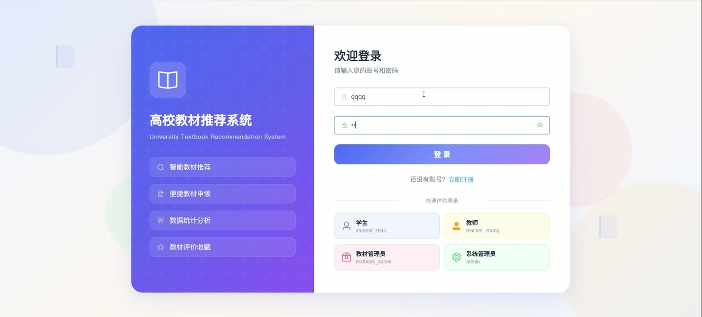
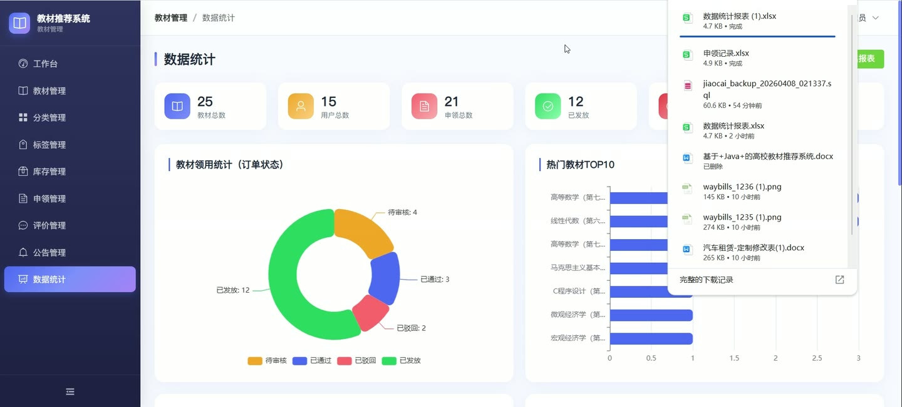
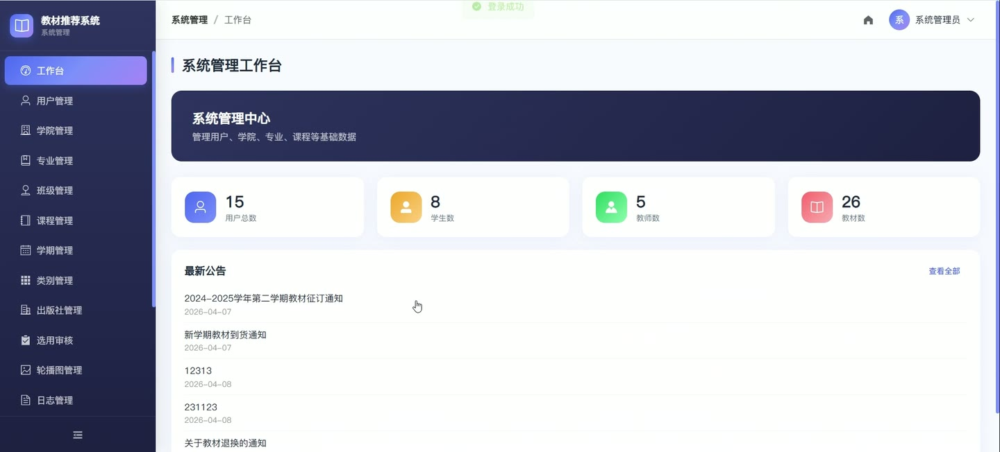
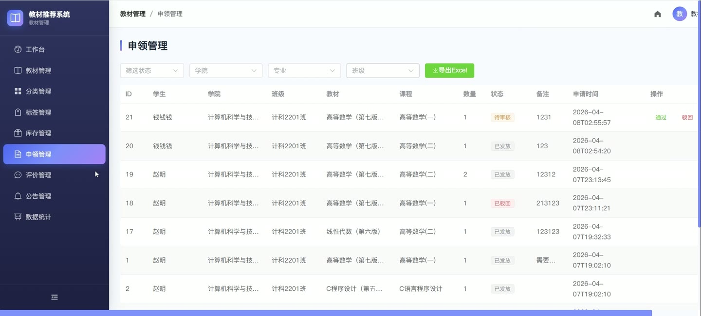
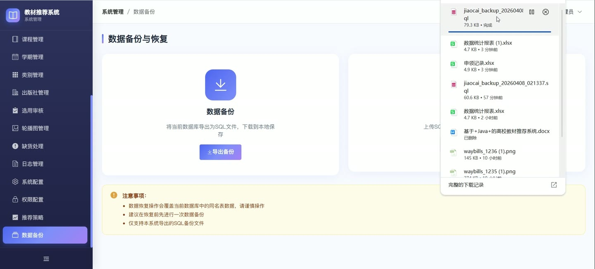
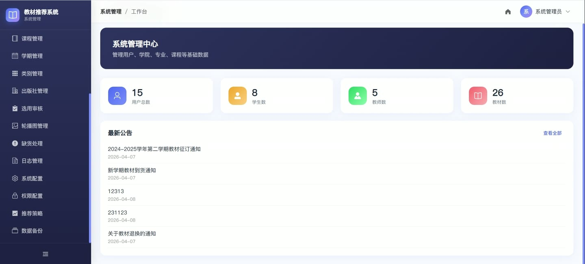

# (附文档)Springboot3+Vue3+MySQL 高校教材推荐系统

**技术栈**：Springboot3、Vue3、MySQL

### 系统简介

本系统是一套基于 Spring Boot 3 + Vue 3 前后端分离的高校教材推荐与管理平台，支持学生在线浏览教材、申领教材、收藏与评价，教师可管理课程教材、审核申领、发布推荐，管理员负责用户审核、教材上架、库存监控、数据备份等全流程管理。
 
### 核心功能
 
### 普通用户端

 
- 注册账号：填写用户名、密码、姓名、学号、学院、专业、班级、年级等信息注册，注册后状态为待审核 
- 登录系统：通过用户名+密码登录，系统校验账号状态（正常/禁用/待审核）并签发 JWT Token 
- 查看首页轮播图：获取状态为已启用的轮播图列表，按排序字段升序展示 
- 查看公告列表：分页获取已发布的公告，支持置顶公告优先展示 
- 查看公告详情：根据公告 ID 获取公告完整内容 
- 浏览教材列表：分页查看已上架教材，支持按关键词（书名/作者）搜索、按分类筛选 
- 查看教材详情：获取教材的完整信息（书名、作者、出版社、分类、封面、简介等） 
- 收藏/取消收藏教材：点击收藏按钮切换收藏状态，系统自动记录收藏时间 
- 查看我的收藏：分页展示当前用户收藏的教材列表 
- 申领教材：填写教材 ID、课程 ID、数量、备注提交申领，状态默认为待审核 
- 查看我的申领记录：分页查看本人提交的教材申领记录及审核状态 
- 评价教材：对已领用（已发放）的教材进行评价，填写评分和内容，每人每教材仅可评价一次 
- 查看教材评价：按教材 ID 分页查看已审核通过的评价 
- 查看智能推荐：系统根据用户专业、课程、收藏/申领行为、热门数据生成个性化推荐列表 
- 查看热门教材：获取被领用次数最多的教材排行 
- 查看最新教材：获取最新上架的 6 本教材 
- 查看我的通知：分页查看系统发送给当前用户的通知消息 
- 查看未读通知数：获取当前用户未读通知的数量 
- 标记通知已读：点击单条通知标记为已读 
- 一键标记全部已读：将所有未读通知标记为已读 
- 缺货登记：提交教材缺货报告，填写教材名称、数量、备注，状态为待处理 
- 查看我的缺货登记：分页查看本人提交的缺货报告及处理回复 
- 预约教材：提交教材预约申请，状态为等待中 
- 取消预约：将本人的预约记录状态改为已取消 
- 查看我的预约：分页查看本人的教材预约记录 
- 查看学院/专业/班级数据：获取启用的学院列表、专业列表（按学院筛选）、班级列表（按专业筛选）
 
### 管理员端

 
- 用户管理：分页查询所有用户，支持按角色/状态筛选，编辑用户信息，启用/禁用账号 
- 审核注册：查看待审核的学生账号，通过或驳回注册申请 
- 教材管理：新增、编辑、删除教材信息（书名、作者、出版社、分类、封面图片、简介等） 
- 教材上架/下架：修改教材状态控制前台是否可见 
- 分类管理：新增、编辑、删除教材分类，支持排序 
- 出版社管理：新增、编辑、删除出版社信息 
- 轮播图管理：新增、编辑、删除首页轮播图，支持设置排序和启用状态 
- 公告管理：新增、编辑、删除系统公告，支持设置置顶 
- 学院管理：新增、编辑、删除学院信息，支持排序 
- 专业管理：新增、编辑、删除专业信息（关联学院），支持排序 
- 班级管理：新增、编辑、删除班级信息（关联专业） 
- 学期管理：新增、编辑、删除学期，设置当前学期 
- 课程管理：新增、编辑、删除课程信息（关联学院/专业/教师） 
- 课程教材审核：查看教师提交的课程教材关联申请，审核通过/驳回 
- 申领审核：查看学生提交的教材申领列表，审核通过/驳回，填写审核备注 
- 申领记录导出：按条件（状态/学院/专业/班级）筛选后导出为 Excel 文件 
- 库存管理：新增/编辑教材库存数量，设置库存预警阈值 
- 库存预警：查看库存低于预警阈值的教材列表 
- 库存变动日志：分页查看教材的入库/出库/调整记录 
- 评价管理：查看所有评价，审核评价状态（正常/隐藏），回复评价 
- 评价举报处理：查看被举报的评价并处理 
- 缺货处理：查看缺货报告，填写处理回复，标记已处理/已驳回 
- 智能推荐配置：开启/关闭推荐模式（专业推荐/课程关联/行为推荐/热门推荐） 
- 系统配置管理：新增、编辑、删除系统配置项（键值对） 
- 角色菜单配置：按角色（管理员/教师/学生）配置前端菜单列表，支持批量保存 
- 操作日志：分页查看系统操作日志，支持按关键词搜索，一键清空日志 
- 数据备份：导出数据库 SQL 备份文件 
- 数据恢复：上传 SQL 文件恢复数据库 
- 文件上传：上传图片等文件，返回可访问的 URL 路径
 
### 教练端

 
- 管理我的课程：查看本人负责的课程列表，新增/编辑/删除课程 
- 课程教材关联：为课程指定教材，提交关联申请（状态为待审核） 
- 查看我的教材关联：分页查看本人提交的课程教材关联记录及审核状态 
- 推荐教材给学生：选择教材和接收对象（班级/学生），填写推荐理由，系统发送通知 
- 查看学生申领：查看选课学生的教材申领记录 
- 申领审核：审核本人课程学生的教材申领，通过/驳回 
- 查看通知：接收系统通知（如审核结果通知）
 
### 技术栈

 后端框架Spring Boot 3.2 ORMMyBatis-Plus 3.5.5 权限认证JWT (jjwt 0.12.5) + 自定义拦截器 前端框架Vue 3 (Composition API) 状态管理Pinia 前端路由Vue Router 4 UI 组件库Element Plus 构建工具Vite 5 数据库MySQL 8.0+ 数据库连接池HikariCP 工具库Hutool 5.8.28 Excel 导出Apache POI 5.2.5
 
### 交付内容

 
- 后端完整源码 
- 前端完整源码 
- 数据库初始化脚本 
- 万字文档

## 界面展示

---

## 获取完整源码 + 万字文档

本仓库为项目介绍页。**完整前后端源码、数据库初始化脚本、万字项目文档**，请加微信 `kangkangcode`，或访问 [codekk.top](http://codekk.top) 获取。

可作课程设计 / 毕业设计参考，支持远程部署调试。